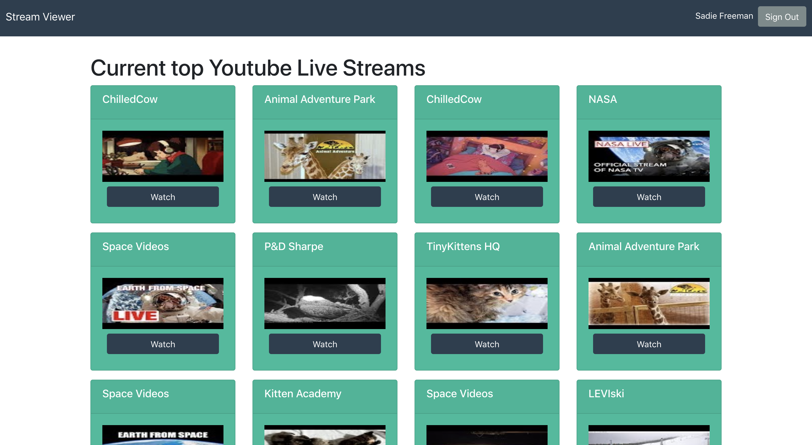
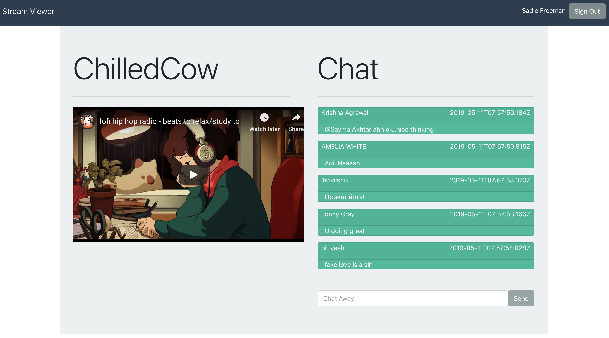

# Stream Viewer

Click to see a recording of a live demo

[Link to Live Demo](https://blissful-mccarthy-410be4.netlify.com/)

[Client Git Repo](https://github.com/sadief/stream-viewer-client)

[Server Git Repo](https://github.com/sadief/stream-viewer)

Notes on Demo and Repos:

- Initially I started working in one repo but when I needed to deploy I had to pull the client out in order to set up the server with Heroku. This means that the majority of my git history lives in the Server Git repo.

- The client is deployed using Netlify, and the server is deployed using Heroku. 

A user (Alex) is able to log into the React app via Auth0 using their Google account. They then need to authenticate the Youtube service in order to view the current top live streams.

The user can click into a stream and view the associated chat, and post chat messages.

The chat messages are send to the server which is written in Go and stored in a Postgres database.

I want to acknowledge that there should be more server participation in this application, however I ran out of time to deisgn a more sophisticated way of fetching and storing the chat messages - I was intending to do some fancy stuff with WebSockets and Go channels. 

The Heroku deployment is currently not working as expected in a classic case of 'it worked on my machine!' and I intend to brute force it into working eventually (if for nothing else than my professional development as a developer)

## Tech Stack

Client
- Create React App
- React Dom
- React Router
- Auth0
- Bootstrap

Server
- Golang
- Postgres

## TODOS

- [ ] Fix Heroku deployment
- [ ] Pull out Bootstrap and implement own design
- [ ] Streamline user authentication flow
- [ ] Use websockets and Go channels to braodcast chat messages
- [ ] Display statistics/rankings of videos
 